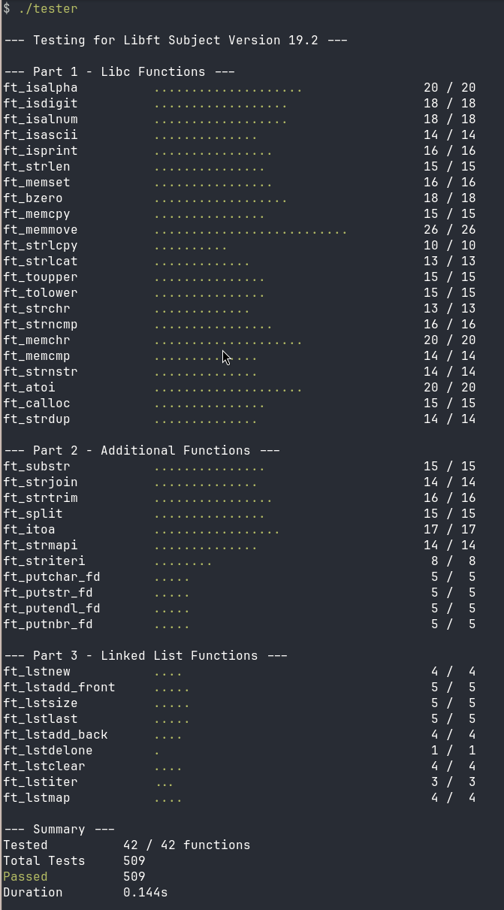

# The Maly Libft Tester

[The Maly Libft Tester Showcase Video on Youtube](https://www.youtube.com/watch?v=XR_jeUo_uzU)

Currently up-to-date with Libft subject version 19.2.

This tester executes over 500 tests in under 0.2 seconds.<br>

# Table of Contents
1. [Prerequisites](#prerequisites)
2. [Building and Running the Tester](#building-and-running-the-tester)
3. [What this tester DOES check](#what-this-tester-does-check)
4. [What this tester does NOT check](#what-this-tester-does-not-check)
5. [Setting up automated tests in your Makefile](#setting-up-automated-tests-in-your-makefile)
6. [Acknowledgments](#acknowledgments)
---


# Prerequisites
*   Linux
*   GCC compiler
*   Your compiled libft.a library

# Building and Running the Tester
Use the provided `build.sh` script.<br>
Pass the path to your compiled `libft.a` archive as the only argument.

```bash
./build.sh <path/to/libft.a>
```
Run the tests:
```bash
./tester
```
For more information (like output files or no-fork mode), run:
```bash
./tester --help
```
# What this tester DOES check
*   Checks correct outputs for all Libft functions.<br>
*   Checks memory leaks using linker-level wrapping.
*   Checks segmentation faults, timeouts, bus errors, double frees using process isolation.<br>
*   Provides detailed hex and string memory dumps in failed_reports.txt for any failed tests.<br>

# What this tester does NOT check
*   Does NOT check if your libft project was written in accordance with the 42 Norm.<br>
*   Does NOT check your libft project's Makefile and its rules, flags, relinking, etc.<br>
*   Does NOT check if you declared any global variables in your project.<br>
*   Does NOT check if you used any unallowed functions in your project. <br>
*   Does NOT check for any README requirements.<br>

# Setting up automated tests in your Makefile
Create one variable for the Tester's directory and one for its arguments.<br>
Make sure to update the path to point to where you cloned the tester:<br>
```make
#  The Maly Libft Tester Setup for Makefile
TESTER_DIRECTORY := ../maly_libft_tester
TESTER_ARGUMENTS := 
```
Create a new rule named test:
```make
test: $(NAME)
	$(TESTER_DIRECTORY)/build.sh ./$(NAME)
	./tester $(TESTER_ARGUMENTS)
```
And declare it as .PHONY so it always runs:
```make
.PHONY: all clean fclean re test
```
Add the compiled tester executable to your existing fclean rule so it gets properly removed alongside your library:
```make
fclean: clean
	$(RM) $(NAME)
	$(RM) tester
```
That is it!

## Acknowledgments
The base and OS layers of this project are derived from [RADDebugger](https://github.com/EpicGamesExt/raddebugger) by Epic Games. I would like to thank the RAD team for sharing their high-quality code, which significantly improved the robustness and portability of this tester.
